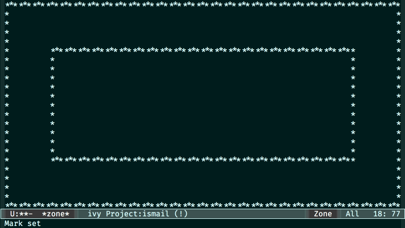

# zone-tunnels

  

A zone program inspired from the old DOS game

## Installation

### Manual

Save the file *zone-tunnels.el* to disk and add the directory containing it to `load-path` using a command in your *.emacs* file like:

    (add-to-list 'load-path "~/.emacs.d/")

The above line assumes that you've placed the file into the Emacs directory '.emacs.d'.

Start the package with:

    (require 'zone-tunnels)

### Marmalade

If you have Marmalade added as a repository to your Emacs, you can just install *zone-tunnels* with

    M-x package-install zone-tunnels RET

## Usage

Set `zone-pgm-tunnels` as one of the zone programs

    (setq zone-programs
          [zone-pgm-tunnels])

and activate zoning by specifying a delay

    (zone-when-idle 30)

Alternatively you can run `zone-tunnels` directly

    (zone-tunnels)
